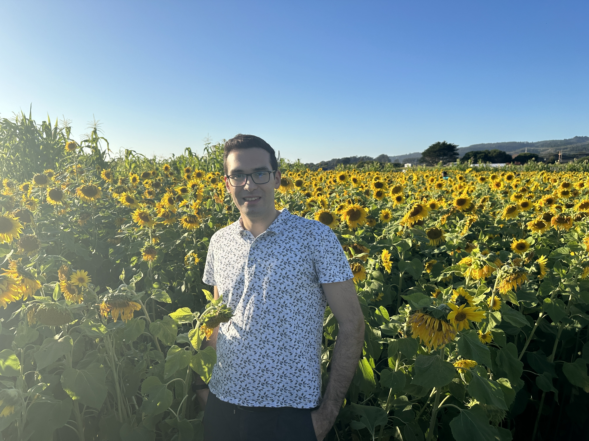

---
# Feel free to add content and custom Front Matter to this file.
# To modify the layout, see https://jekyllrb.com/docs/themes/#overriding-theme-defaults

layout: home
---

### **Education** ###
1. B.S. in Electrical Engineering and Computer Science (2015 - 2018) 
MIT (Massachusetts, US)
2. M.Eng. in Electrical Engineering and Computer Science (2018 - 2019) 
MIT (Massachusetts, US)
3. PhD in Electrical Engineering (2019 - present) 
Stanford University (California, USA)

My current research is on the security and performance of blockchain protocols. I am also broadly interested in consensus protocols, cryptography, information theory and their intersections. I am grateful to have [Prof. David Tse](https://tselab.stanford.edu/) as my PhD advisor. During my PhD, I have done internships with [Celestia](https://celestia.org/), [Babylon Labs](https://babylonlabs.io/), and [a16z crypto research](https://a16zcrypto.com/research/).

For more details about my research and publications, please look at my [CV](CV.pdf).
